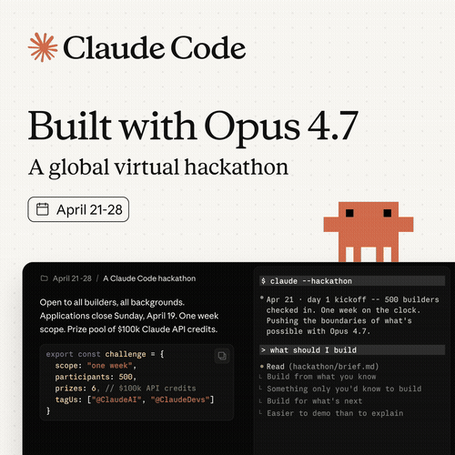

# claude-fleet



**Built for the Claude Opus 4.7 Hackathon.**

[](https://www.anthropic.com/)

**A job system for headless agent sessions.** Run dozens of unattended `claude -p` workers in parallel, each in its own git worktree, with dependency resolution, lease-based crash recovery, and optional auto-land on PASS verdicts. One worker per parcel, one parcel per worktree, one daemon per project.

> _We dogfooded the primitive to build the primitive._ This repo was extracted from `axiom`'s orchestrator by a single headless `claude -p` session — itself a parallel parcel run coordinated by the very state machine it was building. The commit history is the proof; jump to [Receipts](#receipts).

```
$ claude-fleet enqueue migrate-auth --deps schema
$ claude-fleet enqueue add-oauth-flow --deps migrate-auth
$ claude-fleetd                              # daemon picks them up

# Six hours later:
$ claude-fleet summary
status      count
─────────  ──────
landed       2
done         0
running      0
pending      0
```

That's the whole shape. Throw markdown parcels at it, walk away, come back to merged commits.

## Recent Updates

**v0.1.0** (April 2026)
- 🚀 **Initial extraction** - Lifted ~7,500 LOC from `axiom`'s orchestrator by a single headless `claude -p` session running unattended against six pages of spec docs. The build itself was a DSP wave — phases P0–P8 as sub-parcels coordinated by the very state machine the codebase now exposes as a library. 204 tests green on first run. MIT, Python 3.12+, cross-platform (Linux, macOS, Windows).

[View full changelog →](https://github.com/0xDarkMatter/claude-fleet/commits/main)

## Why this exists

Every other parallel-Claude tool today is one of three shapes:

| Tool | Shape | What it doesn't do |
|---|---|---|
| `claude-squad`, `claude-flow` | UI wrapper | Headless. Unattended. Crash recovery. |
| LangGraph, CrewAI | Workflow library | Worktree isolation. Auto-land. State persistence. |
| `for f in *.md; do claude -p < $f; done` | Shell loop | Dependencies. Retries. Anything if it dies. |

`claude-fleet` is a fourth shape: a **job system** specialised for headless agent sessions, where the worktree is the isolation unit and the daemon survives operator absence. Closest analogue is `make` + `git worktree` + a job queue + a CI runner, fused.

## The trilogy

```
┌─────────────────────────────────────────────────────┐
│ axiom            ← multi-agent benchmarking app      │
│   uses ↓                                             │
├─────────────────────────────────────────────────────┤
│ claude-fleet     ← runtime: queue + daemon + worktrees   ◀── you are here
│   uses ↓ (optional)                                  │
├─────────────────────────────────────────────────────┤
│ claude-lb        ← OAuth profile rotation            │
└─────────────────────────────────────────────────────┘
```

Each layer is independently useful. Use claude-fleet alone for single-account local builds. Layer claude-lb under it when you need to fan out across multiple Max plans. Build something axiom-shaped on top when you need agent topology + skill libraries.

## Quickstart (greenfield — 60 seconds)

```bash
mkdir my-fleet && cd my-fleet
git init -b main && git commit --allow-empty -m init

uv pip install claude-fleet
claude-fleet init           # scaffolds yaml, db, parcels/, worktrees/
claude-fleet doctor         # verifies env, claude binary, OAuth, git

claude-fleet parcel new hello-world
# edit parcels/hello-world.md — describe the task

claude-fleet enqueue hello-world
claude-fleetd               # foreground daemon; Ctrl-C to stop
```

In another terminal:

```bash
claude-fleet status hello-world
# ... watch it move pending → claimed → running → done
```

Five-minute walkthrough: [docs/QUICKSTART.md](docs/QUICKSTART.md).

## Adapting to an existing repo

`claude-fleet` is happiest in greenfield projects, but it works fine alongside an existing codebase. We extracted it *from* `axiom`, a sibling project that uses this same orchestrator pattern internally. The retrofit recipe:

1. **`claude-fleet init`** in the repo root — it only writes new files (`claude-fleet.yaml`, `claude-fleet.db`, `parcels/`, `worktrees/.gitignore`). Adds five lines to `.gitignore`. Touches nothing else.
2. **Pick narrow first targets.** Good first parcels: dependency upgrades, lint cleanups, test scaffolding for a leaf module, codemods. Bad first parcels: anything that touches the build system, anything with cross-cutting refactors, anything where the contract between agents isn't already locked down.
3. **Pin `auto_land: false` initially.** Watch verdicts, eyeball the diffs, merge by hand. Flip to `auto_land: true` per-parcel once you trust the test signal.
4. **Use `--deps` to gate by file scope.** Two parcels editing the same module = chain them. Two parcels editing different modules = run them concurrently. Worktree isolation prevents most stomping but not all.
5. **Keep parcels < 90 minutes of agent time.** Longer = lease expiry risk + harder to debug verdicts. Decompose larger work into a parcel chain.

Specific gotchas at scale:

- Worktree creation on a large repo with submodules can take ~15 seconds — tune `lease_seconds` accordingly (default 1800s is generous).
- If your test suite is slow (>5 min), set `auto_land_test_cmd` to a scoped command, not the full suite. The land flow runs it twice (after rebase, before fast-forward).
- Windows + git worktrees: works, but NTFS junctions occasionally lock on `worktree remove`. We retry with backoff; if you see `worktree.WorktreeLockError`, that's it.

## Parcel format

A parcel is one markdown file with YAML frontmatter. The body is the prompt sent to `claude -p`.

```markdown
---
id: add-oauth-flow         # must match the enqueue id
priority: 5                # higher runs first; default 0
deps: [schema-migration]   # ids of parcels that must finish first
max_attempts: 3            # retry cap before -> blocked
auto_land: false           # opt-in per-parcel; overrides global
verdict_adapter: marker-file   # marker-file | exit-code | json-result
---

# Add OAuth flow

You are working in a fresh git worktree. Implement OAuth2 in `src/auth/oauth.py`.

## Acceptance
- All tests in `tests/auth/` pass
- `ruff check src/auth/` clean

## Verdict
When you finish, write `PARCEL_DONE-add-oauth-flow.md` at the worktree root:

    Verdict: PASS

    ## Summary
    <one paragraph>
```

The default verdict adapter (`marker-file`) reads the first `Verdict:` line. Values: `PASS`, `PASS_WITH_WARNINGS`, `BLOCK`, `UNKNOWN`. Other built-ins: `exit-code`, `json-result`. Or implement `VerdictAdapter` for your own. Full reference: [docs/PARCEL_FORMAT.md](docs/PARCEL_FORMAT.md).

## Daemon control

```bash
claude-fleetd                                # foreground; canonical pm2/systemd target
claude-fleetd --profiles max-1,max-2,max-3   # round-robin OAuth profiles

claude-fleet daemon-status                   # liveness via pidfile
claude-fleet daemon-stop                     # SIGTERM
```

Daemon writes its pid to `claude-fleet.pid`. On shutdown it terminates child workers and flips their jobs back to `pending` so the next start picks them up. Crash mid-job? Lease expires after 30 min, job returns to `pending`, retry counter increments. Three failed attempts → `blocked` (operator-only recovery via `requeue`).

## Queue operations

```bash
claude-fleet enqueue <id> [--deps a,b] [--priority N] [--no-verify]
claude-fleet list [--status pending|running|done|failed|blocked|all]
claude-fleet status <id> [--json]
claude-fleet summary [--json]

claude-fleet cancel <id>           # -> failed (terminal)
claude-fleet requeue <id>          # blocked/failed -> pending, attempts reset
claude-fleet reclaim               # one-shot expired-lease sweep

claude-fleet land <id>             # manual land of a PASS'd job
claude-fleet land retry <id>       # retry a merge-blocked land
claude-fleet land history <id>     # land_events rows for a job

claude-fleet worktree list
claude-fleet worktree retire <id>
claude-fleet worktree sweep [--dry-run]
```

## State machine

```
   enqueue ─► pending ──► claimed ──► running ──► done/audited
                  ▲          │            │            │
                  │          │            │       (verdict=PASS
                  │          │            │        + auto_land)
                  │       lease           │            ▼
                  └─── expired ◄──────────┴───      landing
                                                      │
                                              ┌───────┴────────┐
                                              ▼                ▼
                                            landed       merge-blocked
                                          (commit_sha)   (operator
                                                          retry only)
```

Every transition writes a row to SQLite (`jobs` table) and emits a JSON line to the daemon log. The whole machine survives daemon restart — `BEGIN IMMEDIATE` plus WAL mode means two daemons can't claim the same job and a crash never loses state.

## Pluggable

| Interface | Default | Custom |
|---|---|---|
| `OrchestratorBackend` | `WorkerBackend` (subprocess `claude -p`) | Implement for Anthropic Managed Agents, container-based isolation, etc. |
| `VerdictAdapter` | `MarkerFileAdapter` (reads `PARCEL_DONE-<id>.md`) | `ExitCodeAdapter`, `JsonResultAdapter`, or your own |
| `WorktreeLifecycle` | `GitWorktreeLifecycle` | Override for non-git or container-backed isolation |
| `Notifier` | `LogNotifier` | Hook to pigeon, slack, webhooks for `parcel_landed`/`merge_blocked`/`lease_expired` |
| Profile selector | env-var (`CLAUDE_FLEET_PROFILES`) round-robin | `[lb]` extra delegates to `claude-lb` |

[docs/INTEGRATIONS.md](docs/INTEGRATIONS.md) walks through wiring each.

## Receipts

### We dogfooded the primitive to build the primitive

This repo was extracted from `axiom`'s orchestrator (~6,749 LOC of in-production code) by a single headless `claude -p` session running against six pages of spec docs. **The build itself was a DSP wave** — each phase (P0–P8) a sub-parcel, each gap (G1–G10) a sub-sub-parcel, all coordinated by the same kind of state machine and worktree-isolation pattern that the runtime now exposes as a library.

The git history is the proof. Read it bottom-to-top:

```
feat(P8): polish, CHANGELOG, v0.1.0 tag
feat(P7/G9): land retry command
feat(P7/G8): worktree sweep command
feat(P7/G5): claude-lb integration shim
feat(P6/G2): worktree auto-retire on landed
feat(P6/G4): pluggable verdict adapter ABC + registry
feat(P6/G7): doctor command
docs(P5/G10): README + QUICKSTART + examples
feat(P5/G1): worktree lifecycle ABC + GitWorktreeLifecycle
feat(P5/G3): parcel scaffold + validate
feat(P5/G6): init command
feat: P4 — lift tests from Axiom, all green (204 passed, 29 skipped)
feat: P3 -- top-level CLI surface
feat: P2 — decouple from axiom
feat: P1 — lift orchestrator core from axiom
chore: P0 — bootstrap repo
```

That's a real DSP run, with real verdicts, against the very pattern the codebase codifies. No human typed those commits — the agent did, working unattended for under an hour. We watched the queue do its job.

### By the numbers

- **204 unit + integration tests** lifted from axiom, all green on first run
- **~7,500 LOC** in `src/claude_fleet/`
- **Extracted from sibling project `axiom`** — same orchestrator pattern used internally
- **MIT licensed**, Python 3.12+
- **Cross-platform** — Linux, macOS, Windows (including the NTFS worktree quirks)

## Where to read more

- [docs/QUICKSTART.md](docs/QUICKSTART.md) — five-minute walkthrough
- [docs/PARCEL_FORMAT.md](docs/PARCEL_FORMAT.md) — the public contract
- [docs/INTEGRATIONS.md](docs/INTEGRATIONS.md) — claude-lb, custom backends, custom adapters
- [docs/DEPLOYMENT.md](docs/DEPLOYMENT.md) — pm2, systemd, docker examples
- [examples/](examples/) — runnable parcel examples (`01-hello-world`, `02-with-deps`)
- [CHANGELOG.md](CHANGELOG.md)

## License

MIT. See [LICENSE](LICENSE).
